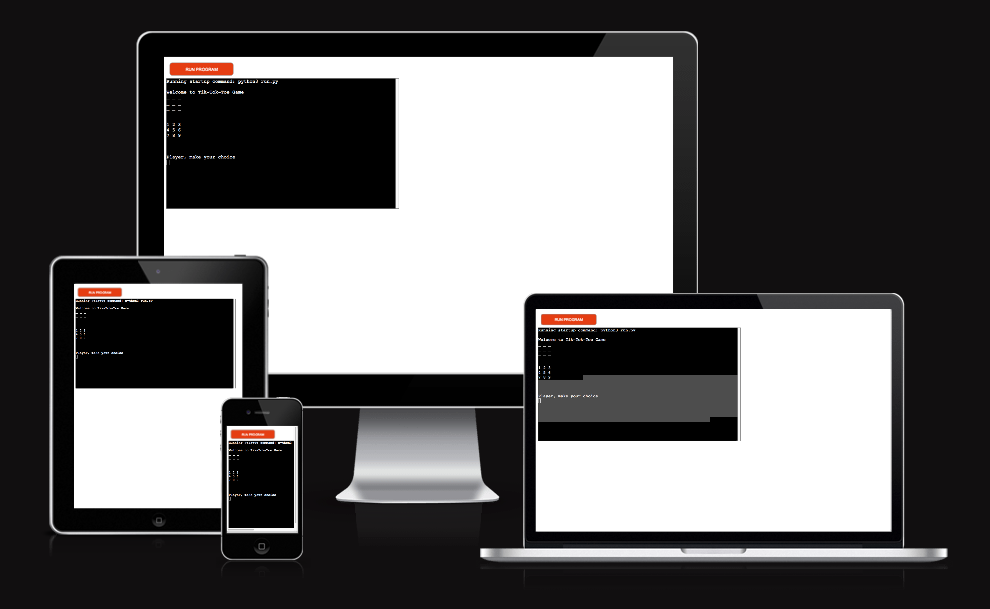
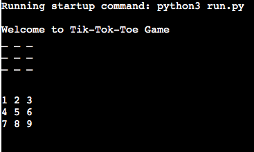
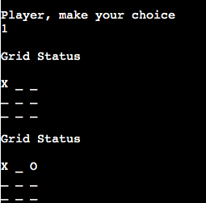
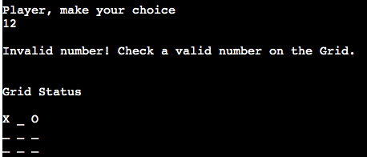
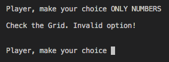
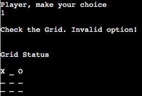
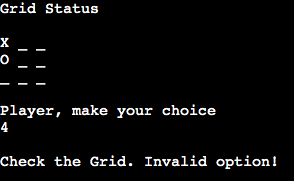

# TikTakToe
 
Project developed for the Full Stack Developer - Code Institute course, using Python 3 to build a game.
 
 
Tic-tac-toe or noughts and crosses is a game for two players who take turns marking the spaces in a three-by-three grid with X or O. The player who succeeds in placing three of their marks in a horizontal, vertical, or diagonal row is the winner. 
 
In this game the player will play against an AI. But in future updates it will be possible to play against someone else.
 
 

[Here is a live version of my project.](https://tik-tak-toe1.herokuapp.com/)
 
 

 
 

## How to play
 

Tic-tac-toe is played on a three-by-three grid by two players, who alternately place the marks X and O in one of the nine spaces in the grid. You can also learn more about it on [Wikipedia](https://en.wikipedia.org/wiki/Tic-tac-toe).
 
In this version the player will always make the first move with X, followed by a random CPU move with O. This will be until there is a winner or a tie, which is when all 9 spaces have already been filled and no one has managed to form a straight of 3.

 
 

## Features

 

### Existing Features

 

* #### Board indication
  
  - At the beginning of the game, a board is presented with the values of their respective positions, ranging from 1 to 9, and a empty board.
 
  
   
   

* #### Automatic indicators
  
  - When you start the game, making your first choice, the board will be updated, indicating your play and which options are free. The same will happen automatically after the CPU plays
  - Play against the computer
  - Accepts user input
   
  
   
   

* #### Input validation and error-checking

  - You cannot enter a valou outside of the board grid
         
  
   
  - You must enter numbers
         
  
   
  - You cannot enter the same guess twice
       
  
   
  - You cannot enter the same CPU guess
         
  
 
 

* #### Future Features
  - Have a two player option.
  - Let the player select difficulty levels against the CPU.
  - Let the player select who starts playing.
 
 

[Back to the top](#tiktaktoe)
 
 

## Testing
 
I have manually tested this project by doing the following:
 
  

  - Passed the code through a PEP8 linter and confirmed there are no problems
  - Given invalid inputs: out of bounds inputs, same input twice
  - Tested in my local terminal and the Code Institute Heroku terminal.

 

## Bugs
### Solves Bugs
- When I wrote the code, when entering a value above the number of positions, it broke, making it impossible to continue. With the implementation of the function `valid_number()` this bug was solved.

### Unfixed Bugs
- No unfixed bugs
 

### Validator Testing
- PEP8
  - No errors were returned from PEP8online.com
  

## Deployment
 
This project was deployed using Code Institute's mock terminal for Heroku.
 

- Steps for deployment:
 - Fork or clone this repository
 - Create a new Heroku app
 - Set the buildbacks to `pytho` and `NodeJS`in that order
 - Link the Heroku app to the repositoryß
 - Click on ***Deploy***
 

## Credits
- Code Institute for the deployment terminal
- Wikipedia for the details of the Tik Tak Toe game
 

[Back to the top](#Jokenpô)